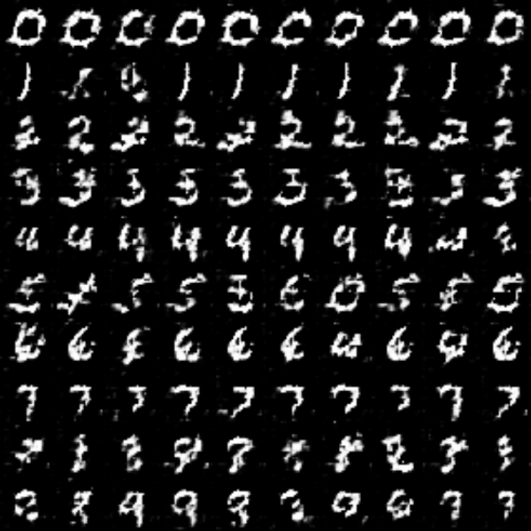

# conditionalDCGAN
MNISTをconditionalDCGANで生成するプログラム

## 使い方
* 学習

```python ctreate_dataset.py```

mnistをpickleに保存して使用しています.

```python train.py```

Trainerを使わない記述方法です.

* 画像生成

```python test.py -mri result_id -l class_label```

学習済みモデルから画像を1枚生成します. 

    * result_idには利用したいgenerator.pyが保存されたresult直下のフォルダ名を指定

    * class_labelには生成したいクラスのラベル(0〜9)を指定

        * (ex) クラス0 --> 1;0;0;0;0;0;0;0;0;0

```test_sample.bat```を実行すると, クラス0〜9指定画像と,
全て0指定, 全て1指定, 1と3を0.5ずつ指定した画像を生成できます.

## 動作環境
* python==3.6.1
* chainer==3.5.0
* cupy==2.5.0
* cuda==v8.0
* cuDNN==v6
* GPU: GeForce GTX 1080

## サンプル


## 参考
下記のサイトを参考に致しました.

https://qiita.com/lyakaap/items/a9ae5d91464e72774093
